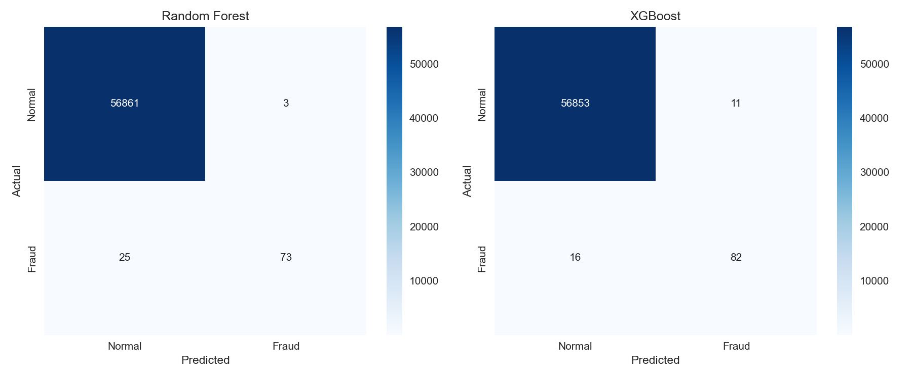

# Fraud Detection + Business Impact Simulator

End-to-end machine learning pipeline on the [Kaggle Credit Card Fraud Detection](https://www.kaggle.com/datasets/mlg-ulb/creditcardfraud) dataset.

## Dataset

- 284,807 transactions, 492 fraud (0.17%)
- 28 PCA-transformed features (V1-V28), Amount, Time, Class

## Project Structure

```
fraud-detection-simulator/
├── notebooks/
├── src/
├── models/
├── data/
├── outputs/
│   ├── figures/
│   └── metrics/
├── assets/
├── app.py
└── requirements.txt
```

## Sprint Progress

- [x] Sprint 1 - EDA
- [x] Sprint 2 - Modeling
- [ ] Sprint 3 - Explainability
- [ ] Sprint 4 - Business Impact
- [ ] Sprint 5 - Streamlit Dashboard

## Key Findings - EDA

- Severe class imbalance: 99.83% normal, 0.17% fraud
- Fraud transactions have higher mean amount (122 vs 88) but lower max (2125 vs 25691)
- V features are uncorrelated with each other (PCA design)
- Two daily peaks visible in Time distribution

## Key Findings - Modeling

- Naive baseline: 99.83% accuracy but 0 fraud detected
- XGBoost best overall: Recall 0.84, Precision 0.88, F1 0.86
- SMOTE increases recall to 0.92 but drops precision to 0.06
- Random Forest lowest false positives: only 3 normal transactions flagged


| Model               | Fraud Recall | Fraud Precision | F1   | ROC-AUC |
| ------------------- | ------------ | --------------- | ---- | ------- |
| Naive Baseline      | 0.00         | 0.00            | 0.00 | -       |
| Logistic Regression | 0.63         | 0.83            | 0.72 | 0.96    |
| SMOTE LR            | 0.92         | 0.06            | 0.11 | 0.97    |
| Class Weights LR    | 0.92         | 0.06            | 0.11 | 0.97    |
| Random Forest       | 0.74         | 0.96            | 0.84 | 0.95    |
| XGBoost             | 0.84         | 0.88            | 0.86 | 0.97    |


